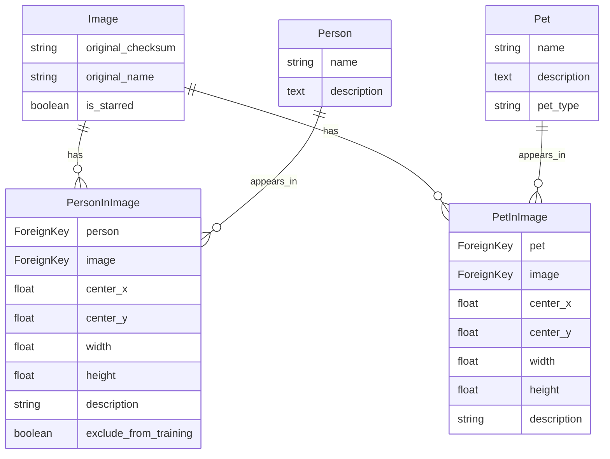
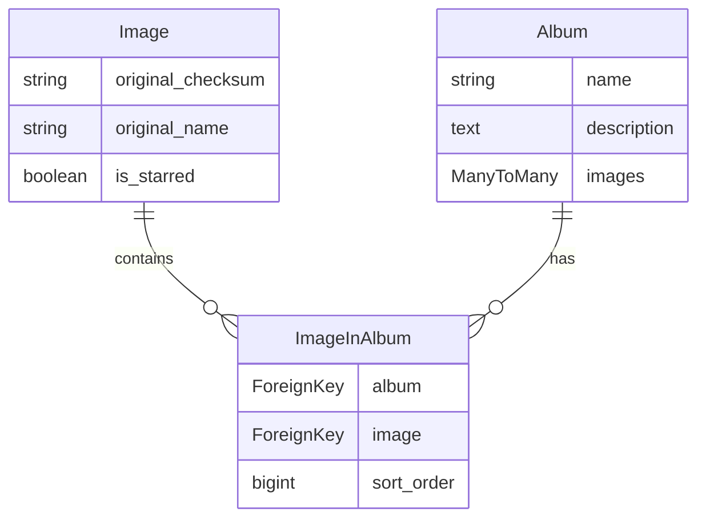
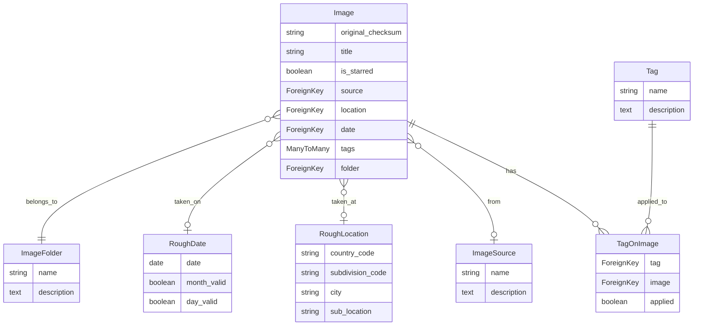

# Architecture

## Database Relations

```mermaid
erDiagram
    Image ||--o{ PersonInImage : has
    Person ||--o{ PersonInImage : appears_in
    Image ||--o{ PetInImage : has
    Pet ||--o{ PetInImage : appears_in

    Person {
        string name
        text description
    }

    PersonInImage {
        ForeignKey person
        ForeignKey image
        float center_x
        float center_y
        float width
        float height
        string description
        boolean exclude_from_training
    }

    Pet {
        string name
        text description
        string pet_type
    }

    PetInImage {
        ForeignKey pet
        ForeignKey image
        float center_x
        float center_y
        float width
        float height
        string description
    }

    Image {
        string original_checksum
        string original_name
        boolean is_starred
    }
```

```mermaid
erDiagram
    Image ||--o{ ImageInAlbum : contains
    Album ||--o{ ImageInAlbum : has

    Album {
        string name
        text description
        ManyToMany images
    }

    ImageInAlbum {
        ForeignKey album
        ForeignKey image
        bigint sort_order
    }

    Image {
        string original_checksum
        string original_name
        boolean is_starred
    }
```

```mermaid
erDiagram
    Image }o--|| ImageFolder : belongs_to
    Image }o--o| RoughDate : taken_on
    Image }o--o| RoughLocation : taken_at
    Image }o--o| ImageSource : from
    Image ||--o{ TagOnImage : has
    Tag ||--o{ TagOnImage : applied_to

    Tag {
        string name
        text description
    }

    TagOnImage {
        ForeignKey tag
        ForeignKey image
        boolean applied
    }

    ImageSource {
        string name
        text description
    }

    RoughDate {
        date date
        boolean month_valid
        boolean day_valid
    }

    RoughLocation {
        string country_code
        string subdivision_code
        string city
        string sub_location
    }

    ImageFolder {
        string name
        text description
    }

    Image {
        string original_checksum
        string title
        boolean is_starred
        ForeignKey source
        ForeignKey location
        ForeignKey date
        ManyToMany tags
        ForeignKey folder
    }
```
