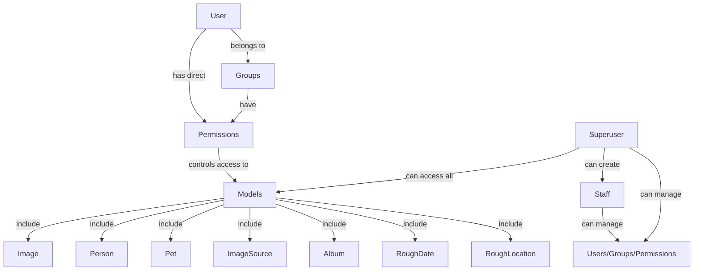
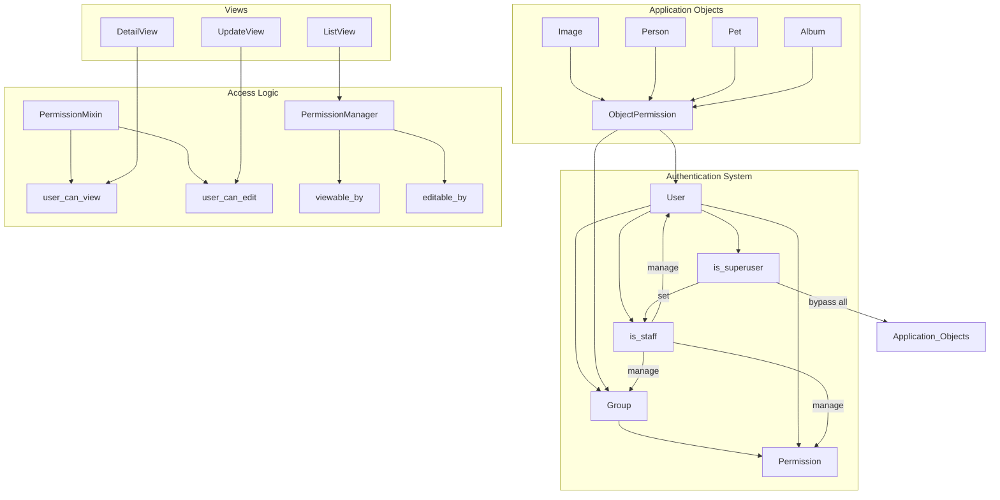

# Role-Based Access Control System for Django

I'll help you design a robust RBAC system for your Django application that handles permissions for various models while leveraging Django's built-in authentication framework.

## Overview of the System

Let's start with a high-level overview of how the permission system will work:



!!! note "Default Access Rule"
If no permissions are explicitly set for a model instance, it will be accessible to all users.

## Permission Models

First, let's create models to handle object-level permissions. We'll need a base permission model that can be linked to any model instance:

```python
from django.db import models
from django.contrib.auth.models import User, Group
from django.contrib.contenttypes.models import ContentType
from django.contrib.contenttypes.fields import GenericForeignKey

class ObjectPermission(models.Model):
    """
    Defines view/edit permissions for any model instance
    """
    content_type = models.ForeignKey(ContentType, on_delete=models.CASCADE)
    object_id = models.PositiveIntegerField()
    content_object = GenericForeignKey('content_type', 'object_id')

    # Who has permission
    user = models.ForeignKey(User, on_delete=models.CASCADE, null=True, blank=True)
    group = models.ForeignKey(Group, on_delete=models.CASCADE, null=True, blank=True)

    # Type of permission
    can_view = models.BooleanField(default=False)
    can_edit = models.BooleanField(default=False)

    created_at = models.DateTimeField(auto_now_add=True)

    class Meta:
        constraints = [
            models.CheckConstraint(
                check=models.Q(user__isnull=False) | models.Q(group__isnull=False),
                name='permission_has_user_or_group'
            )
        ]
        indexes = [
            # Composite indexes specifically helpful for PostgreSQL permission lookups
            models.Index(fields=['content_type', 'object_id']),
            models.Index(fields=['content_type', 'object_id', 'user']),
            models.Index(fields=['content_type', 'object_id', 'group']),
            # Indexes for permission type lookups
            models.Index(fields=['can_view']),
            models.Index(fields=['can_edit']),
        ]

    def __str__(self):
        target = self.user.username if self.user else self.group.name
        perms = []
        if self.can_view:
            perms.append('view')
        if self.can_edit:
            perms.append('edit')
        return f"{target} can {'+'.join(perms)} {self.content_type.model} #{self.object_id}"
```

## Mixin for Your Models

Let's create a mixin that you can add to all your models to provide permission-related functionality:

```python
from django.contrib.contenttypes.fields import GenericRelation
from django.db import models

class PermissionMixin(models.Model):
    """
    Mixin to add to models that need object-level permissions
    """
    permissions = GenericRelation(ObjectPermission)

    class Meta:
        abstract = True

    def get_permissions_for_user(self, user):
        """Get permissions for a specific user"""
        if user.is_superuser:
            return {'can_view': True, 'can_edit': True}

        # Check for empty permissions - means open to all
        if self.permissions.count() == 0:
            return {'can_view': True, 'can_edit': False}

        # Direct user permissions
        user_perms = self.permissions.filter(user=user)

        # Group permissions
        group_perms = self.permissions.filter(group__in=user.groups.all())

        # Combine permissions
        can_view = user_perms.filter(can_view=True).exists() or group_perms.filter(can_view=True).exists()
        can_edit = user_perms.filter(can_edit=True).exists() or group_perms.filter(can_edit=True).exists()

        return {'can_view': can_view, 'can_edit': can_edit}

    def user_can_view(self, user):
        """Check if user can view this object"""
        if user.is_superuser:
            return True
        if self.permissions.count() == 0:
            return True
        perms = self.get_permissions_for_user(user)
        return perms['can_view']

    def user_can_edit(self, user):
        """Check if user can edit this object"""
        if user.is_superuser:
            return True
        if self.permissions.count() == 0:
            return False
        perms = self.get_permissions_for_user(user)
        return perms['can_edit']
```

## Apply the Mixin to Your Models

Now you can apply this mixin to all your models:

```python
class Image(PermissionMixin, models.Model):
    # Your existing fields
    title = models.CharField(max_length=255)
    # ...

class Person(PermissionMixin, models.Model):
    # Your existing fields
    name = models.CharField(max_length=255)
    # ...

class Pet(PermissionMixin, models.Model):
    # Your existing fields
    name = models.CharField(max_length=255)
    # ...

# And so on for other models...
```

## Custom QuerySet Manager (PostgreSQL-Optimized)

Let's create a custom QuerySet manager to automatically filter objects based on user permissions. This implementation is optimized specifically for PostgreSQL:

```python
class PermissionQuerySet(models.QuerySet):
    def viewable_by(self, user):
        """Return only objects viewable by the user - optimized for PostgreSQL"""
        if user.is_superuser:
            return self

        # Create a subquery to identify objects with no permissions
        from django.db.models import Exists, OuterRef, Subquery

        content_type_id = ContentType.objects.get_for_model(self.model).id

        # PostgreSQL performs well with EXISTS subqueries
        no_perms = ~Exists(
            ObjectPermission.objects.filter(
                content_type_id=content_type_id,
                object_id=OuterRef('pk')
            )
        )

        # User view permissions
        user_view_perms = Exists(
            ObjectPermission.objects.filter(
                content_type_id=content_type_id,
                object_id=OuterRef('pk'),
                user=user,
                can_view=True
            )
        )

        # Group view permissions - for PostgreSQL, we can use a more efficient subquery
        if user.groups.exists():  # Only add this condition if user has groups
            group_ids = user.groups.values_list('id', flat=True)
            group_view_perms = Exists(
                ObjectPermission.objects.filter(
                    content_type_id=content_type_id,
                    object_id=OuterRef('pk'),
                    group_id__in=group_ids,
                    can_view=True
                )
            )
            # Return objects with any type of permission
            return self.filter(no_perms | user_view_perms | group_view_perms)
        else:
            # No need to check group permissions if user has no groups
            return self.filter(no_perms | user_view_perms)

    def editable_by(self, user):
        """Return only objects editable by the user - optimized for PostgreSQL"""
        if user.is_superuser:
            return self

        content_type_id = ContentType.objects.get_for_model(self.model).id

        # User edit permissions
        user_edit_perms = Exists(
            ObjectPermission.objects.filter(
                content_type_id=content_type_id,
                object_id=OuterRef('pk'),
                user=user,
                can_edit=True
            )
        )

        # Group edit permissions
        if user.groups.exists():  # Only add this condition if user has groups
            group_ids = user.groups.values_list('id', flat=True)
            group_edit_perms = Exists(
                ObjectPermission.objects.filter(
                    content_type_id=content_type_id,
                    object_id=OuterRef('pk'),
                    group_id__in=group_ids,
                    can_edit=True
                )
            )
            # Return objects with explicit edit permissions
            return self.filter(user_edit_perms | group_edit_perms)
        else:
            # No need to check group permissions if user has no groups
            return self.filter(user_edit_perms)

class PermissionManager(models.Manager):
    def get_queryset(self):
        return PermissionQuerySet(self.model, using=self._db)

    def viewable_by(self, user):
        return self.get_queryset().viewable_by(user)

    def editable_by(self, user):
        return self.get_queryset().editable_by(user)
```

Now update your models to use this manager:

```python
class Image(PermissionMixin, models.Model):
    # Your existing fields
    title = models.CharField(max_length=255)
    # ...

    objects = models.Manager()  # Default manager
    permissions_manager = PermissionManager()  # Custom manager
```

## Views Implementation

Now let's implement the views using Django's class-based views:

### ListView Example

```python
from django.views.generic import ListView
from django.contrib.auth.mixins import LoginRequiredMixin

class ImageListView(LoginRequiredMixin, ListView):
    model = Image
    template_name = 'images/image_list.html'
    context_object_name = 'images'

    def get_queryset(self):
        """Filter images to show only those the user can view"""
        return Image.permissions_manager.viewable_by(self.request.user)

    def get_context_data(self, **kwargs):
        context = super().get_context_data(**kwargs)

        # Add which images are editable by this user
        editable_images = Image.permissions_manager.editable_by(self.request.user)
        editable_ids = set(editable_images.values_list('id', flat=True))

        context['editable_image_ids'] = editable_ids
        return context
```

### DetailView Example

```python
from django.views.generic import DetailView
from django.contrib.auth.mixins import LoginRequiredMixin
from django.http import Http404

class ImageDetailView(LoginRequiredMixin, DetailView):
    model = Image
    template_name = 'images/image_detail.html'
    context_object_name = 'image'

    def get_object(self, queryset=None):
        obj = super().get_object(queryset)

        # Check if user can view this object
        if not obj.user_can_view(self.request.user):
            raise Http404("You don't have permission to view this image")

        return obj

    def get_context_data(self, **kwargs):
        context = super().get_context_data(**kwargs)
        # Add edit permission info
        context['can_edit'] = self.object.user_can_edit(self.request.user)
        return context
```

### UpdateView Example

```python
from django.views.generic.edit import UpdateView
from django.contrib.auth.mixins import LoginRequiredMixin
from django.core.exceptions import PermissionDenied

class ImageUpdateView(LoginRequiredMixin, UpdateView):
    model = Image
    template_name = 'images/image_form.html'
    fields = ['title', 'description', 'file']  # Add your actual fields

    def get_object(self, queryset=None):
        obj = super().get_object(queryset)

        # Check if user can edit this object
        if not obj.user_can_edit(self.request.user):
            raise PermissionDenied("You don't have permission to edit this image")

        return obj
```

## User and Group Management

Create views for managing users, groups, and permissions:

```python
from django.views.generic import ListView, CreateView, UpdateView, DeleteView
from django.contrib.auth.mixins import UserPassesTestMixin
from django.urls import reverse_lazy
from django.contrib.auth.models import User, Group, Permission
from django import forms

class StaffRequiredMixin(UserPassesTestMixin):
    def test_func(self):
        return self.request.user.is_staff

class SuperuserRequiredMixin(UserPassesTestMixin):
    def test_func(self):
        return self.request.user.is_superuser

class UserListView(StaffRequiredMixin, ListView):
    model = User
    template_name = 'admin/user_list.html'
    context_object_name = 'users'

class UserCreateView(StaffRequiredMixin, CreateView):
    model = User
    template_name = 'admin/user_form.html'
    fields = ['username', 'email', 'first_name', 'last_name', 'groups']
    success_url = reverse_lazy('user-list')

class UserUpdateView(StaffRequiredMixin, UpdateView):
    model = User
    template_name = 'admin/user_form.html'
    fields = ['username', 'email', 'first_name', 'last_name', 'groups', 'is_active']
    success_url = reverse_lazy('user-list')

    def get_form(self, form_class=None):
        form = super().get_form(form_class)
        # Only superusers can set staff status
        if self.request.user.is_superuser:
            form.fields['is_staff'] = forms.BooleanField(required=False, initial=self.object.is_staff)
            form.fields['is_superuser'] = forms.BooleanField(required=False, initial=self.object.is_superuser)
        return form

    def form_valid(self, form):
        # Handle the staff and superuser fields if present
        if self.request.user.is_superuser and 'is_staff' in form.cleaned_data:
            self.object.is_staff = form.cleaned_data['is_staff']
        if self.request.user.is_superuser and 'is_superuser' in form.cleaned_data:
            self.object.is_superuser = form.cleaned_data['is_superuser']
        return super().form_valid(form)
```

!!! warning "Security Note"
Be careful to check permissions at multiple levels: in views, in templates, and even in API endpoints if you're building them.

## Object Permission Management

Let's create a view to manage permissions for any object:

```python
from django.views.generic import FormView
from django.contrib.auth.mixins import LoginRequiredMixin
from django.shortcuts import get_object_or_404
from django.contrib.contenttypes.models import ContentType
from django import forms

class ObjectPermissionForm(forms.ModelForm):
    user = forms.ModelChoiceField(queryset=User.objects.all(), required=False)
    group = forms.ModelChoiceField(queryset=Group.objects.all(), required=False)

    class Meta:
        model = ObjectPermission
        fields = ['user', 'group', 'can_view', 'can_edit']

    def clean(self):
        cleaned_data = super().clean()
        user = cleaned_data.get('user')
        group = cleaned_data.get('group')

        if not user and not group:
            raise forms.ValidationError("Either a user or a group must be specified")

        return cleaned_data

class ObjectPermissionCreateView(LoginRequiredMixin, StaffRequiredMixin, FormView):
    template_name = 'admin/object_permission_form.html'
    form_class = ObjectPermissionForm

    def get_success_url(self):
        model_name = self.kwargs['model']
        obj_id = self.kwargs['pk']
        return reverse_lazy(f'{model_name}-detail', kwargs={'pk': obj_id})

    def form_valid(self, form):
        model_name = self.kwargs['model']
        obj_id = self.kwargs['pk']

        # Get the model class based on model_name
        # This is a simplified version; you would need a mapping dictionary in practice
        model_mapping = {
            'image': Image,
            'person': Person,
            'pet': Pet,
            # Add other models
        }

        model_class = model_mapping.get(model_name)
        if not model_class:
            return HttpResponseBadRequest("Invalid model type")

        # Get the object
        obj = get_object_or_404(model_class, pk=obj_id)

        # Create the permission
        content_type = ContentType.objects.get_for_model(model_class)
        perm = ObjectPermission(
            content_type=content_type,
            object_id=obj_id,
            user=form.cleaned_data.get('user'),
            group=form.cleaned_data.get('group'),
            can_view=form.cleaned_data.get('can_view', False),
            can_edit=form.cleaned_data.get('can_edit', False)
        )
        perm.save()

        return super().form_valid(form)
```

## PostgreSQL-Specific Optimizations

Since we're using PostgreSQL exclusively, we can take advantage of some PostgreSQL-specific features for better performance:

```python
from django.contrib.postgres.indexes import BrinIndex

class ObjectPermission(models.Model):
    # ... existing fields ...

    class Meta:
        # ... existing constraints and indexes ...
        indexes = [
            # ... existing indexes ...
            # BRIN index can be more efficient for large tables with timestamp data
            BrinIndex(fields=['created_at']),
        ]
```

You can also use materialized views for complex permission reports if needed:

```python
from django.db import connection

def refresh_permission_summary():
    """Refresh materialized view for permission summaries"""
    with connection.cursor() as cursor:
        cursor.execute("""
        REFRESH MATERIALIZED VIEW permission_summary;
        """)
```

## Example Template Usage

Here's how you might handle permissions in templates:

```html
<!-- image_list.html -->
<h1>Images</h1>
<div class="image-grid">
  
  <div class="image-card">
    
    <h3>{{ image.title }}</h3>
    <div class="actions">
      <a href="">View</a>
      
      <a href="">Edit</a>
      
    </div>
  </div>
  
  <p>No images available.</p>
  
</div>
```

## Final System Overview Diagram

Here's how the entire system fits together:



!!! tip "Default Permission Logic"
Remember that items with no explicit permissions are viewable by all users but not editable by default.

## Deployment Considerations

1. **Migrations**: Run migrations to create all necessary tables and indexes
2. **Initial Data**: Create initial superuser and staff accounts
3. **Permission Management UI**: Create interfaces for staff to manage permissions
4. **Performance Testing**: Test with large datasets to ensure filter queries perform well

This RBAC system gives you fine-grained control over who can view and edit each object in your system while leveraging Django's built-in authentication framework. It also respects your requirements for staff management and default permissions. The implementation is specifically optimized for PostgreSQL to ensure excellent performance even with large datasets.
