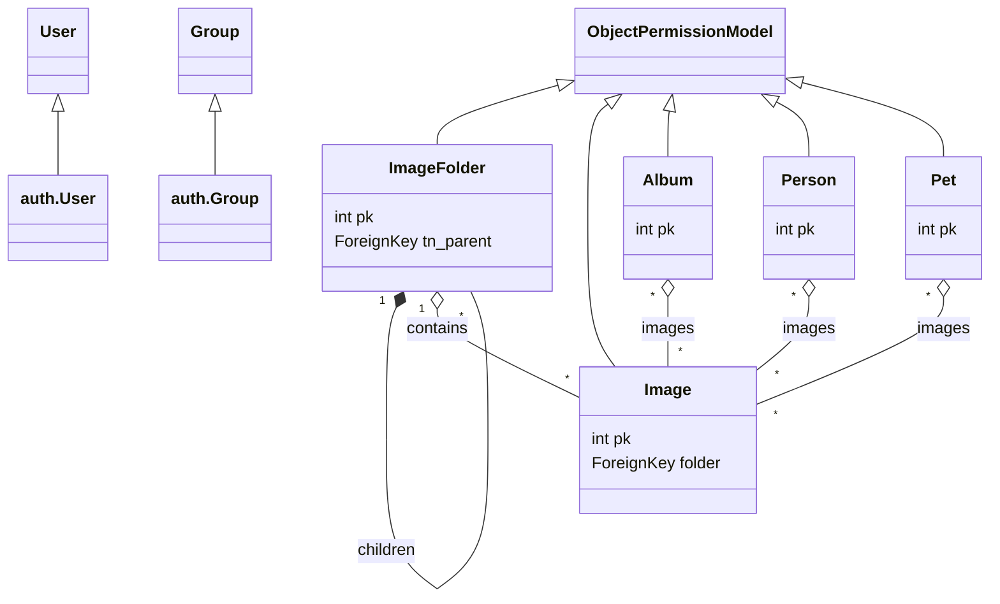

## Role-Based Access Control with Object-Level Permissions in Django

This guide shows how to implement group-based object-level permissions in Django 5, covering models `Image`, `ImageFolder`, `Person`, `Pet`, and `Album`. We will use Django's built-in `User` and `Group` models, plus an abstract mixin to share permission fields, and a permission mixin to filter querysets and enforce view/edit rights. We’ll delegate as much filtering as possible to the database and use django-treenode’s `tn_` fields.

---

### 1. Abstract Permission Model Mixin

Create an abstract base model to add `view_groups` and `edit_groups` to any model.

```python
from django.db import models
from django.contrib.auth.models import Group

class ObjectPermissionModel(models.Model):
    """
    Abstract model providing view/edit group relations.
    If no groups are assigned, object is open to all authenticated users.
    Superusers bypass all checks.
    """
    view_groups = models.ManyToManyField(
        Group,
        blank=True,
        related_name="%(class)ss_viewable",
        help_text="Groups allowed to view this object",
    )
    edit_groups = models.ManyToManyField(
        Group,
        blank=True,
        related_name="%(class)ss_editable",
        help_text="Groups allowed to edit this object",
    )

    class Meta:
        abstract = True
```

---

### 2. Data Model Diagram



!!! note "Superuser Overrides"
Superusers bypass all checks: they can view and edit every object regardless of group assignments.

---

### 3. Permission Mixin

Define a mixin to filter object querysets based on view/edit groups (editors can also view) and active status.

```python
from django.db.models import Q
from django.contrib.auth.mixins import LoginRequiredMixin
from django.views.generic import ListView, DetailView, UpdateView
from typing import Any

class ObjectPermissionModelMixin(LoginRequiredMixin):
    """
    CBV mixin to enforce object-level view/edit permissions.
    Set `permission_type` to 'view' or 'edit' in subclasses.
    Editors (edit permission) also implicitly have view permission.
    """
    permission_type: str  # 'view' or 'edit'

    def get_queryset(self):
        user = self.request.user
        base_qs = super().get_queryset()
        if not user.is_active:
            return base_qs.none()
        if user.is_superuser:
            return base_qs

        groups = user.groups.all()
        if self.permission_type == 'view':
            # include objects open to all, viewers, or editors
            return base_qs.filter(
                Q(view_groups__isnull=True) |
                Q(view_groups__in=groups) |
                Q(edit_groups__in=groups)
            ).distinct()

        # edit permission: open to all editors or specific editors
        return base_qs.filter(
            Q(edit_groups__isnull=True) |
            Q(edit_groups__in=groups)
        ).distinct()

    def has_object_permission(self, obj: Any) -> bool:
        user = self.request.user
        if not user.is_active:
            return False
        if user.is_superuser:
            return True

        if self.permission_type == 'view':
            allowed = set(obj.view_groups.all()) | set(obj.edit_groups.all())
        else:
            allowed = set(obj.edit_groups.all())
        return not allowed or bool(allowed & set(user.groups.all()))
```

---

### 4. Example: `ImageFolder` Views with django-treenode

Use django-treenode built‑ins (`get_roots_queryset`, `get_children_queryset`) and `tn_` fields, filtering in the database.

#### ListView

```python
class ImageFolderListView(ObjectPermissionModelMixin, ListView[ImageFolder]):
    model = ImageFolder
    permission_type = 'view'
    paginate_by = 20

    def get_queryset(self):
        user = self.request.user
        # get all tree roots (tn_parent is null)
        roots = ImageFolder.get_roots_queryset()
        # filter via permission mixin
        qs = super().get_queryset().filter(
            pk__in=roots.values_list('pk', flat=True)
        )
        return qs.select_related('tn_parent').prefetch_related('view_groups', 'edit_groups')
```

#### DetailView

```python
class ImageFolderDetailView(ObjectPermissionModelMixin, DetailView[ImageFolder]):
    model = ImageFolder
    permission_type = 'view'

    def dispatch(self, request, *args, **kwargs):
        folder = self.get_object()
        if not self.has_object_permission(folder):
            raise PermissionDenied
        return super().dispatch(request, *args, **kwargs)

    def get_context_data(self, **kwargs):
        ctx = super().get_context_data(**kwargs)
        user = self.request.user
        folder = ctx['object']
        groups = user.groups.all()

        # children: direct descendants via tree node
        ctx['children'] = folder.get_children_queryset().filter(
            Q(view_groups__isnull=True) |
            Q(view_groups__in=groups) |
            Q(edit_groups__in=groups)
        ).distinct().select_related('tn_parent')

        # contained images
        ctx['images'] = folder.images.filter(
            Q(view_groups__isnull=True) |
            Q(view_groups__in=groups) |
            Q(edit_groups__in=groups)
        ).distinct()

        return ctx
```

---

### 5. UpdateView Example

```python
class ImageFolderUpdateView(ObjectPermissionModelMixin, UpdateView[ImageFolder]):
    model = ImageFolder
    fields = ['name', 'tn_parent', 'view_groups', 'edit_groups']
    permission_type = 'edit'

    def dispatch(self, request, *args, **kwargs):
        obj = self.get_object()
        if not self.has_object_permission(obj):
            raise PermissionDenied
        return super().dispatch(request, *args, **kwargs)
```

---

### 6. Template Snippet (Jinja2 + Bootstrap 5)

```jinja


<div class="container mt-4">
  <h2>{{ folder.name }}</h2>
  <div class="row">
    
      <div class="col-md-3 mb-3">
        <div class="card shadow rounded">
          <div class="card-body">
            <h5 class="card-title">{{ child.name }}</h5>
            <a href="{{ url('imagefolder-detail', child.pk) }}" class="btn btn-primary">Open</a>
          </div>
        </div>
      </div>
    
  </div>
  <hr>
  <h3>Images</h3>
  <div class="row">
    
      <div class="col-md-2 mb-2">
        
      </div>
    
  </div>
</div>

```

---

## Conclusion

By using django-treenode’s `tn_` fields and delegating tree and permission filters directly to the database, along with an abstract `ObjectPermissionModel` and `ObjectPermissionModelMixin`, you achieve efficient, scalable object-level role-based access control. Apply these patterns to `Image`, `Person`, `Pet`, and `Album` similarly.
